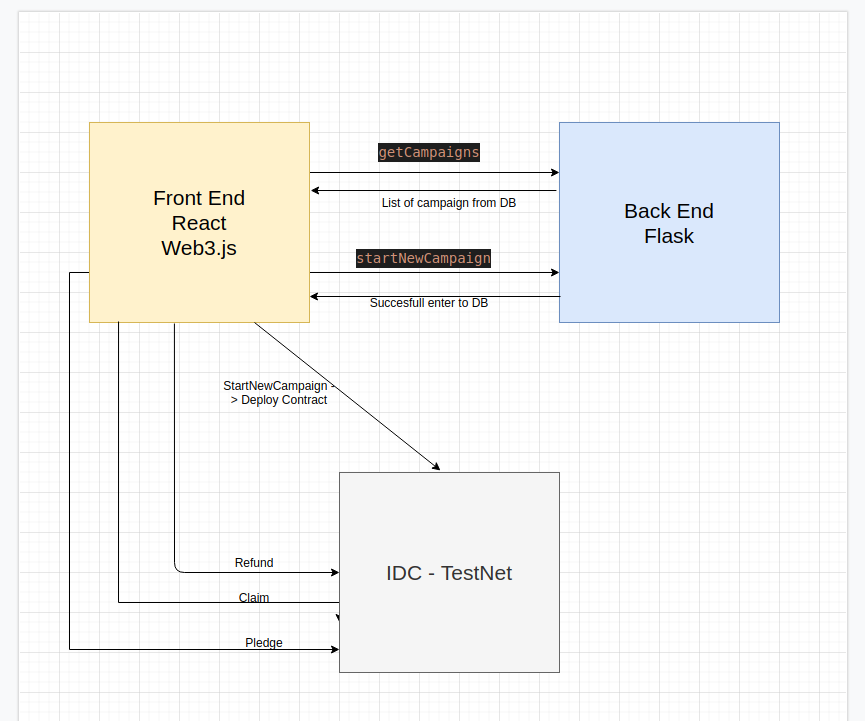

# blockchain
Architecture overview:

Installation and running:

1. Install MetaMask and make sure you are connected to IDC testnet.
2. git clone https://Daniel.Meller@vcs.ap.idc.ac.il/blockchain/project/201639663_038198149_finalProject
3. cd blockchain
4. docker-compose up
5. This proces may take a few minutes since all sub components for the dockers and client parts shouold be installed for your local env
6. Once you see "Starting the development server..." you shouold go to localhost:3001

User guideline:

1. Go to localhost:3001. You shouo
2. In order to launch a new campaign fill in the boxes under the title "start new campaign", give the campaign a new name, supply 3 adddresses for accoount that will be the owners of the campaign. Owners are the one that can then withdraw the campaign funds once the campign is successfully completed. Add a relative time in seconds for the campaign to end, and add the goal. 
3. press the button: "publish campaign.". Metamask will ask you to confirm the deployment of the contract. A few seconds later (depends on the IDC testnet node) the new campaign will appear in the campaigns list.
4. Once you have one campaign in your arsenal you can start donating it money by adding donation size and contract address under "Donate Money". After a successful donation you will see the balance of the contract right next to the text box. Just make sure you are signed in with the account you want to donate the money from.
5. If the relative time for the campaign passed and the goals are not reached then you can now refund the money. Go to the REFUND and add the address of the contract you would like to get refund from.
6. For testing purposes you can manage multiple accounts in MetaMask and donate the money from them. Just make sure you refresh the page once you do it so that the state of the client wallet will be up-to-date. 
7. If a campaign time is up and the goals are reached you can now suppply two signatures in order to withdraw the money. The signatures are splitted to 3 parts: r,s,v. For testing purposes we have added "test withdraw" which receives the private keys of the two owners (that can be extracted from MetaMask) and splits them up with the secret key word "WITHDRAW" 
8. In order to withdraw just add these 3 parts to withdraw, and the address of the contract that you want to get the money from and apply withdraw. 
9. For testing purposes you may also find a prepared file with the relevant data called: client\testing_details.txt, There you can use the details to publish a withdraw funds without going through the hassle. 

Architecture: 
Described in the image

